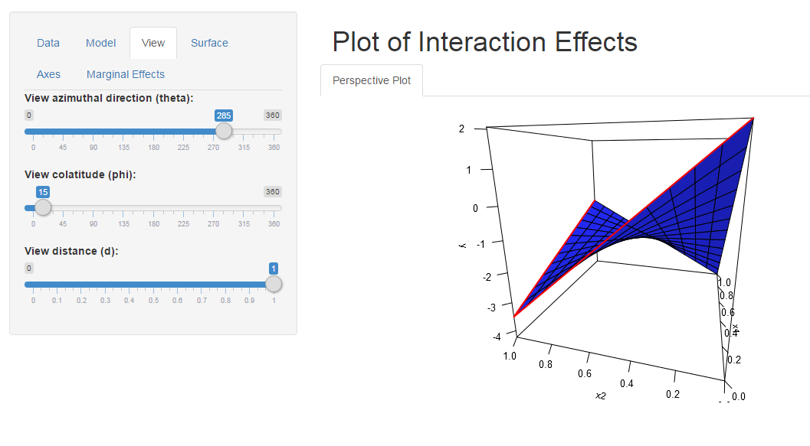

# Perspective Plot for Interaction Effects

This is a simple interactive perspective plot, built using Shiny, to examine interaction effects in a linear model.

To run it, do:

```R
library("shiny")
runGitHub("interaction-plot", "leeper")
```

The app looks like this:


